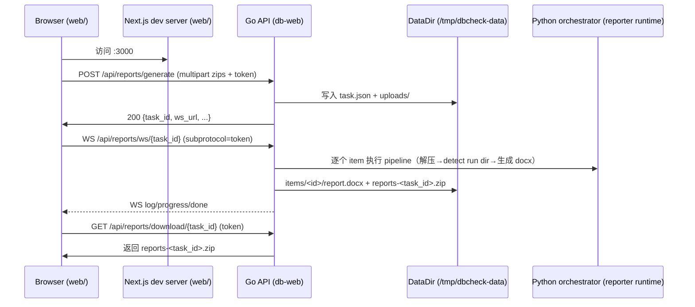

# dbcheck-web 前后端逻辑（db-web + web/）

适用范围：`db-web`（Go 后端）+ `web/`（Next.js 前端）  
目标：让维护者能快速定位代码入口、理解端到端数据流，并能稳定联调/部署。

## 1. 总览

`db-web` 提供一个“上传采集 ZIP → 生成报告 → 下载结果 ZIP”的服务端管道，并通过 WebSocket 推送日志与进度；`web/` 提供一个三步式 UI（选库型→上传→生成/下载）。



## 2. 后端（db-web）逻辑

### 2.1 入口与配置

- 入口：`reporter/cmd/db-web/main.go`
  - `web.ParseConfig(args, getenv)`：解析参数与环境变量
  - `web.Run(cfg)`：启动 HTTP 服务
- 配置：`reporter/internal/web/config.go`
  - 必需：
    - `DBCHECK_DATA_DIR`：任务落盘目录（内部会创建 `tasks/`）
    - `ALLOWED_ORIGINS`：CORS/WS origin 白名单（逗号分隔；支持 `*`）
    - `DBCHECK_API_TOKEN`：HTTP Bearer token + WS subprotocol token
  - 常用参数：
    - `--addr` / `DBCHECK_ADDR`：监听地址（默认 `:8080`）
    - `--python-bin` / `DBCHECK_PYTHON_BIN`：执行 orchestrator 的 python（默认 `python3`）
    - `--retention-ttl`：任务自动清理 TTL（默认 24h）

### 2.2 HTTP 路由与鉴权/CORS

路由注册在 `reporter/internal/web/http_handler.go`：

- `POST /api/reports/generate`
  - `Authorization: Bearer <DBCHECK_API_TOKEN>`
  - `multipart/form-data`：
    - `zips`：一个或多个 `.zip`
    - 可选 `awr_<index>`：第 `index` 个 zip 对应的 AWR HTML（`.html/.htm`）
  - 返回：`{ task_id, ws_url, total, status }`
- `GET /api/reports/status/{task_id}`：查询任务状态（done 时包含 `download_url`）
- `GET /api/reports/download/{task_id}`：下载结果 ZIP（仅 `done`）
- `GET /api/reports/ws/{task_id}`：WebSocket（推送日志/进度/完成）

鉴权逻辑：

- HTTP：`requireAuth`（`Authorization` Bearer token 必须等于 `cfg.APIToken`）
- WS：`requireWSAuth`（`Sec-WebSocket-Protocol` 列表里包含 token 才允许）

CORS/Origin allowlist：

- 包装器 `withCORS` 会对非空 `Origin` 做白名单校验，不通过直接 `403 origin not allowed`。
- 白名单实现：`reporter/internal/web/origin_allowlist.go`
  - 支持：完整 origin、host-only、`host:port`、`*`
  - 当白名单包含 `localhost`/`127.0.0.1`（含端口）时，会自动扩展同端口的本机私网地址，避免用 Next dev server 的 Network 地址打开前端时触发 CORS。

### 2.3 任务落盘结构

任务根目录：`<DBCHECK_DATA_DIR>/tasks/<task_id>/`（见 `reporter/internal/web/task_store.go`）

典型结构：

```text
<data_dir>/tasks/<task_id>/
  task.json
  uploads/
    zip-1-xxx.zip
    awr-1-xxx.html
  items/
    1/
      extract/            # 解压后的 run 包（会被清理/重建）
      report.docx
    2/
      ...
  reports-<task_id>.zip   # 对外下载的聚合包（只包含成功 item 的 docx）
```

### 2.4 Pipeline：从 ZIP 到 report.docx

实现位置：`reporter/internal/web/pipeline.go`

单个 item 的关键步骤：

1. 解压 ZIP 到 `items/<id>/extract/`（`ExtractZipFile`）
2. 在解压目录内定位 `runDir`（`DetectRunDirByManifest`：通过 `manifest.json` 识别）
3. 通过 `launcher.ResolveAssetLayout(executablePath, cfg)` 解析运行时脚本/资产布局
4. 调用 Python orchestrator（`CommandRunner.Run(pythonBin, [script, args...])`）产出 `report.docx`

日志/进度推送：

- `taskHub`：`reporter/internal/web/ws_hub.go`
  - `emitLog/emitProgress/emitDone/emitError` 统一封装并注入递增 `seq`
  - 支持 “重连补发”：`snapshot()` 先回放最近 N 行日志，再发一条 progress snapshot

### 2.5 WS 消息类型（与前端契约对齐）

后端结构体：`reporter/internal/web/ws_messages.go`，实际发送 payload 在 `ws_hub.go` 注入 `seq`。

- `log`：`{type, seq, timestamp, level, message}`
- `progress`：`{type, seq, completed, total, current_file}`
- `done`：`{type, seq, download_url}`
- `error`：`{type, seq, message}`

## 3. 前端（web/）逻辑

### 3.1 代码结构与入口

- App Router 入口：`web/src/app/page.tsx`（组合三步流程组件）
- 全局状态：`web/src/stores/report-store.ts`（zustand）
- API 基址与 WS URL：
  - `web/src/lib/api.ts`
    - `getApiBase()`：优先 sessionStorage，其次 `NEXT_PUBLIC_API_BASE`，最后从 `window.location` 推断
    - dev 便捷推断：当前页面端口是 `3000` 时，默认后端 `http://127.0.0.1:8080`
    - `wsUrl(path)`：根据 API base 协议切换 `ws/wss`

### 3.2 用户流程（3-step）

1. Step 1 选择 DB 类型：组件 `web/src/components/db-type-selector.tsx`
2. Step 2 上传 ZIP（可多份）：
  - `web/src/components/file-upload-step.tsx`
  - ZIP 列表与 AWR（Oracle）配对 UI：`web/src/components/file-pair-card.tsx`
3. Step 3 生成 + 下载：
  - `web/src/components/generation-step.tsx`
  - `fetch POST /api/reports/generate` → 拿到 `{task_id, ws_url}`
  - 通过 WebSocket 订阅 `ws_url`，实时更新日志与进度，完成后展示下载按钮

### 3.3 Token / API base 的处理策略

- Token：
  - UI 输入后保存到 zustand store
  - 同时写入 `sessionStorage["dbcheck_api_token"]`，刷新/重连可恢复
- API base：
  - 可在生成页手动输入（写入 `sessionStorage["dbcheck_api_base"]`）
  - 未配置时遵循 `getApiBase()` 推断规则（见 3.1）

### 3.4 generate 请求的表单字段

`web/src/components/generation-step.tsx`：

- ZIP：逐个 `form.append("zips", file, name)`
- AWR：与 ZIP 顺序对齐，使用 `awr_<index>`（从 1 开始）
  - 例如第一个 zip 对应 `awr_1`

> 注意：后端也支持 `awrs` 数组字段，但前端当前使用 `awr_<index>` 方式。

## 4. PM2 统一管理（源码运行）

仓库现有：

- PM2 入口：`ecosystem.config.cjs`
  - `dbcheck-api`：通过 `scripts/pm2/run_api.sh` 拉起 Go 后端（dev: `go run`；prod: 优先 `bin/db-web`）
  - `dbcheck-web`：通过 `scripts/pm2/run_web.sh` 拉起 Next 前端（dev: `next dev`；prod: `next start`）

建议：

- **PM2 只用于管理 Web 服务前后端**（`db-web` + `web/`），不管理 `db-collector` / `db-reporter` 这类一次性 CLI 任务。
- dev：确保已准备 `.venv`（Python 依赖）以及 `web/` 已 `npm install`，再执行：
  - `make pm2-start`
- prod：先 build，再执行：
  - `make build-db-web`
  - `make web-build`
  - `make pm2-start-prod`
- smoke：最小链路验证（curl 上传 e2e zip → 轮询 → 下载）：
  - `make pm2-smoke`

## 5. 常见坑 / 联调注意事项

1. **前端 API Base 推断对“局域网访问”不友好**  
   `web/src/lib/api.ts` 中：只要页面端口是 `3000`，就会把后端推断为 `http://127.0.0.1:8080`。  
   - 本机联调：这是期望行为  
   - 让同网段其他机器访问 `http://<你的IP>:3000`：访问者浏览器会去请求它自己的 `127.0.0.1:8080`，必失败  
   解决：显式设置 `NEXT_PUBLIC_API_BASE`（或在生成页手动输入 API Base）。

2. **WebSocket 鉴权依赖 `Sec-WebSocket-Protocol`**  
   前端用 `new WebSocket(url, [token])` 传 token；如果接入 Nginx/网关/反向代理，需要确保该 header 不被剥离，否则会出现“HTTP 正常但 WS 401”。

3. **刷新页面不会自动接回旧任务**  
   `web/src/components/generation-step.tsx` 写入了 `sessionStorage["dbcheck_task_id"]`，但当前没有读取它并用 `/api/reports/status/<id>` 恢复 UI 状态；刷新后更可能重新发起一次 `/generate`。

4. **前端没有用 status 轮询做兜底**  
   当前进度主要依赖 WS；如果 WS 在某些环境被限制，UI 可能无法更新（后端已有 `/api/reports/status/<task_id>` 可用）。

5. **下载链接不能直接浏览器打开**  
   `download_url` 需要 `Authorization: Bearer ...` 才能访问；手动测试请用 `curl` 或前端下载按钮。

6. **并发/压测不是当前设计目标**  
   后端队列 `queue` 有容量上限（32）且满时会直接丢弃入队请求；当前是单 worker 处理，适合“一次少量 ZIP”的生成场景。

7. **重启/审计诉求**  
   WS 日志缓存是内存态；服务重启会丢历史日志（任务本身可通过落盘恢复到队列继续跑）。如需审计追溯，建议将 log 事件同步落盘。

8. **安全与资源配额**  
   当前限制了上传大小，但未对 ZIP 解压后的总体积/文件数设置硬限制；对外开放时建议增加解压配额限制，避免 zip bomb。
