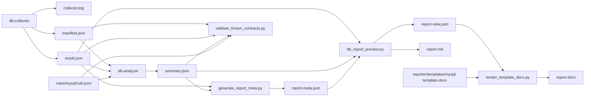
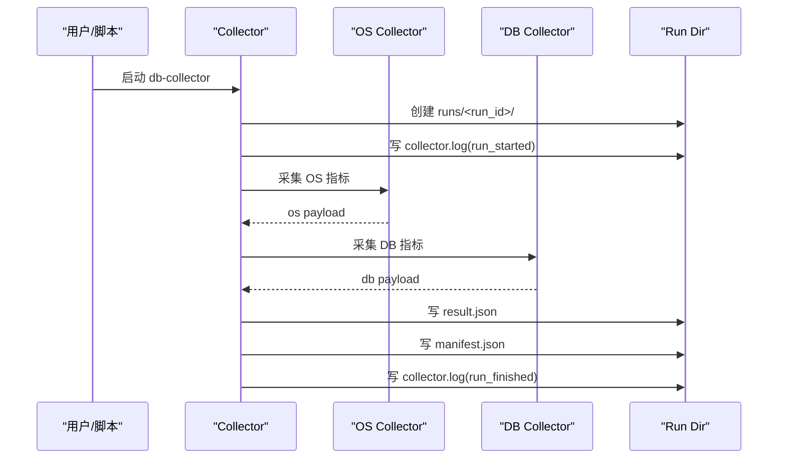
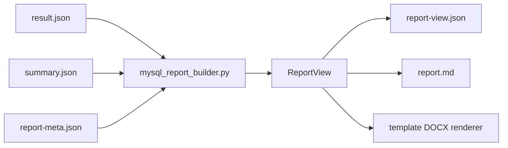
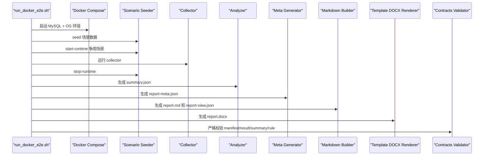

# 数据库巡检工具业务全景与实现流程

本文档面向交付、研发和测试三类视角，说明当前 `db-check` 项目如何从一次巡检采集，走到最终 Word 报告交付。

重点回答 4 个问题：

1. 一次巡检从启动到交付最终经历了哪些环节。
2. 每个环节产出什么文件、由谁消费、用什么规范约束。
3. `manifest.json`、`result.json`、`summary.json`、`report-meta.json`、`report-view.json`、`report.md`、`report.docx` 之间是什么关系。
4. Docker E2E 如何把真实业务场景、真实采集、真实汇总、真实报告串成完整闭环。

## 1. 项目定位

当前项目把数据库巡检拆成 5 层：

1. 采集层：采集 OS 和 DB 事实，输出结构化事实层和执行态。
2. 契约层：定义输入输出 JSON 的冻结结构和 Schema 校验规则。
3. 分析层：将 `result.json` 与 `rule.json` 结合，产出 `summary.json`。
4. 报告内容层：把事实、结论和人工补充元数据装配成统一的 `ReportView`。
5. 文档输出层：把 `ReportView` 渲染成 Markdown 报告，并进一步按 Word 模板渲染成最终 DOCX。

对应代码入口：

- 采集层：[service.go](/Users/lmj/projects/ai-project/db-check/collector/internal/core/service.go)
- 分析层：[db_analyzer.py](/Users/lmj/projects/ai-project/db-check/analyzer/cli/db_analyzer.py)
- 报告内容层：[mysql_report_builder.py](/Users/lmj/projects/ai-project/db-check/reporter/content/mysql_report_builder.py)
- Markdown 报告入口：[db_report_preview.py](/Users/lmj/projects/ai-project/db-check/reporter/cli/db_report_preview.py)
- DOCX 模板渲染入口：[render_template_docx.py](/Users/lmj/projects/ai-project/db-check/reporter/cli/render_template_docx.py)
- Docker E2E 编排：[run_docker_e2e.sh](/Users/lmj/projects/ai-project/db-check/tests/e2e/run_docker_e2e.sh)

## 2. 当前正式主链路

当前项目的正式主链路如下：



当前有 3 个重要实现事实：

1. `result.json` 是事实层，`summary.json` 是分析层，两者严格分离。
2. `report-view.json` 和 `report.md` 是正式报告内容层中间产物，不是临时预览文件。
3. 最终 Word 报告统一通过模板样式渲染器生成，不再维护兼容型 DOCX 输出通路。

## 3. 从业务视角看，一次巡检到底做了什么

### 3.1 采集前准备

在真实运行前，系统需要确定以下内容：

- 目标类型：当前主实现为 MySQL
- 连接参数：主机、端口、用户名、密码、数据库名
- 采样模式：单次采样或周期采样
- 输出目录：每次运行生成独立 `run_id`
- 规则定义：本次分析使用哪个 `rule.json`
- 报告模板：最终 Word 输出使用哪个 `.docx` 模板

在 Docker E2E 中，这些前置动作由脚本统一编排：

- [run_docker_e2e.sh](/Users/lmj/projects/ai-project/db-check/tests/e2e/run_docker_e2e.sh)
- [apply_scenarios.sh](/Users/lmj/projects/ai-project/db-check/tests/e2e/docker/mysql/apply_scenarios.sh)

### 3.2 采集阶段

Collector 做两类事情：

1. 执行态记录
- 生成结构化日志 `collector.log`
- 记录每个关键步骤的开始、结束、耗时、状态
- 写入 `manifest.json` 的 `module_stats`、`exit_code`、`artifacts`

2. 事实层采集
- OS 事实写入 `result.json.os`
- DB 事实写入 `result.json.db`
- 元数据、采样窗口、采样模式写入 `result.json.meta / collect_config / collect_window`

Collector 内部真实时序可对应到代码：[service.go](/Users/lmj/projects/ai-project/db-check/collector/internal/core/service.go)



### 3.3 分析阶段

Analyzer 的职责不是再采集数据，而是做 3 件事：

1. 校验输入
- 文件存在校验
- Schema 校验
- 冻结契约校验
- 跨文件一致性校验

2. 执行规则判定
- 读取 `rule.json`
- 基于路径表达式从 `result.json` 抽取值
- 执行门控、NA 判定、阈值判定、信息项整理

3. 输出汇总结论
- 生成 `summary.json`
- 给出 `overall_risk`
- 汇总 `counts`
- 列出 `abnormal_items / unevaluated_items / na_items`

实现入口：
- [db_analyzer.py](/Users/lmj/projects/ai-project/db-check/analyzer/cli/db_analyzer.py)
- [rule_engine.py](/Users/lmj/projects/ai-project/db-check/analyzer/evaluator/rule_engine.py)
- [path_eval.py](/Users/lmj/projects/ai-project/db-check/analyzer/evaluator/path_eval.py)

### 3.4 报告内容装配阶段

系统不会直接把 `result.json` 和 `summary.json` 原样塞进 Word，而是先构建统一报告视图：`ReportView`。

数据来源分层如下：

- `result.json`：事实层
- `summary.json`：风险与结论层
- `report-meta.json`：文档控制与范围信息层
- `ReportView`：最终展示模型层

`ReportView` 的定义见：[report_view.py](/Users/lmj/projects/ai-project/db-check/reporter/model/report_view.py)



这层做的事情包括：

1. 固定章节组装
- `文档控制`
- `第一章 巡检总结`
- `第二章 巡检明细`

2. 报告语言转换
- 将 `summary` 的异常项转为“风险发现与整改建议”
- 将计数和核心事实转为“巡检结论”自然语言摘要

3. 表格风格收口
- 单行参数表
- 普通多行记录表
- 宽表紧凑记录表 + 字段说明

相关文档：
- [报告内容设计.md](/Users/lmj/projects/ai-project/db-check/docs/reporting/报告内容设计.md)
- [报告模板设计要点.md](/Users/lmj/projects/ai-project/db-check/docs/reporting/报告模板设计要点.md)

### 3.5 Markdown 报告阶段

`db_report_preview.py` 负责输出两份正式中间产物：

- `report.md`
- `report-view.json`

它的职责是：

1. 读取 `result.json`
2. 读取 `summary.json`
3. 读取 `report-meta.json`
4. 验证输入 contracts
5. 构建 `ReportView`
6. 输出 Markdown 报告和结构化报告视图

入口文件：[db_report_preview.py](/Users/lmj/projects/ai-project/db-check/reporter/cli/db_report_preview.py)

### 3.6 Word 报告阶段

最终 Word 报告统一走模板样式渲染路径：

- [render_template_docx.py](/Users/lmj/projects/ai-project/db-check/reporter/cli/render_template_docx.py)
- [template_docx_renderer.py](/Users/lmj/projects/ai-project/db-check/reporter/renderer/template_docx_renderer.py)

特点：

- 消费 `report-view.json`
- 基于 [mysql-template.docx](/Users/lmj/projects/ai-project/db-check/reporter/templates/mysql-template.docx) 保持主题、段落、标题、表格样式
- 保留模板封面与自动编号
- 将 `report.md` 的章节结构与模板样式收敛到同一份最终交付文档

因此，从“最终业务报告交付”的视角，正式链路是：

```text
result.json + summary.json
-> report-meta.json
-> ReportView
-> report.md + report-view.json
-> template-styled report.docx
```

## 4. 规范定义到底有哪些

当前实现依赖 4 类规范。

### 4.1 冻结架构规范

它定义系统为什么要分层，以及每层的职责边界。

- [最小架构规范.md](/Users/lmj/projects/ai-project/db-check/docs/architecture/最小架构规范.md)

核心约束：
- `result.json` 只存事实
- 执行态独立沉淀到 `manifest.json`
- 分析结果单独输出 `summary.json`
- 报告不反向污染事实层

### 4.2 冻结契约规范

它定义 JSON 文件最小字段和语义边界。

- [冻结契约说明.md](/Users/lmj/projects/ai-project/db-check/docs/specs/冻结契约说明.md)

核心对象：
- `manifest.json`
- `result.json`
- `summary.json`

### 4.3 Schema 规范

它定义结构层面“长什么样”。

- [manifest.schema.json](/Users/lmj/projects/ai-project/db-check/contracts/schemas/manifest.schema.json)
- [result.schema.json](/Users/lmj/projects/ai-project/db-check/contracts/schemas/result.schema.json)
- [summary.schema.json](/Users/lmj/projects/ai-project/db-check/contracts/schemas/summary.schema.json)
- [rule.schema.json](/Users/lmj/projects/ai-project/db-check/contracts/schemas/rule.schema.json)

### 4.4 规则规范

它定义“如何把事实转成风险结论”。

- [rule.json](/Users/lmj/projects/ai-project/db-check/rules/mysql/rule.json)

当前规则已包含：
- 维度定义
- check 定义
- gate / threshold / row_count / info 等评估方式
- `NA` 门控与适用性约束

## 5. 各层产物职责

| 产物 | 生产者 | 主要输入 | 作用 | 下一跳 |
| --- | --- | --- | --- | --- |
| `collector.log` | Collector | 运行过程 | 人读日志、排障、进度追踪 | 人工排障 |
| `manifest.json` | Collector | 运行态 | 执行态、退出码、模块状态、产物索引 | Analyzer / Contracts 校验 |
| `result.json` | Collector | 采集结果 | OS/DB 事实层 | Analyzer / Reporter / Contracts 校验 |
| `summary.json` | Analyzer | `manifest + result + rule` | 风险等级、异常项、NA 项 | Reporter / Contracts 校验 |
| `report-meta.json` | Meta Generator | `result + summary + 运行上下文` | 文档控制和范围信息 | Report Builder |
| `report-view.json` | Report Builder | `result + summary + meta` | 统一报告展示模型 | Markdown / DOCX Renderer |
| `report.md` | Markdown Renderer | `ReportView` | 正式 Markdown 报告 | 人工审阅 / DOCX 渲染输入参考 |
| `report.docx` | Template DOCX Renderer | `report-view.json + mysql-template.docx` | 最终交付文档 | 最终输出 |

## 6. Docker E2E 为什么是完整闭环

当前 Docker E2E 不是简单把采集程序跑起来，而是完整模拟真实交付闭环。

### 6.1 版本矩阵

当前 E2E 覆盖：

- MySQL 5.6
- MySQL 5.7
- MySQL 8.0

编排入口：[run_docker_e2e.sh](/Users/lmj/projects/ai-project/db-check/tests/e2e/run_docker_e2e.sh)

### 6.2 场景注入

E2E 启动容器后，会注入真实业务场景，确保不是“数据库空跑”。

场景来源：
- [init.sql](/Users/lmj/projects/ai-project/db-check/tests/e2e/docker/mysql/init.sql)
- [scenarios.sql](/Users/lmj/projects/ai-project/db-check/tests/e2e/docker/mysql/scenarios.sql)
- [apply_scenarios.sh](/Users/lmj/projects/ai-project/db-check/tests/e2e/docker/mysql/apply_scenarios.sh)

这些场景覆盖了：
- 慢查询
- 全表扫描 SQL
- 无主键表
- MyISAM 表
- 宽表
- 自增使用率
- 冗余索引
- 过多索引对象
- 宽联合索引对象
- 临时表 SQL
- 行锁等待
- 元数据锁
- 备份历史记录

### 6.3 E2E 实际时序



### 6.4 E2E 验证什么

E2E 测试不会只看程序退出码，而是检查：

1. 三个版本都生成完整产物
2. `db path` 没有 extraction gap
3. `summary` 的 `NA` 和异常语义正确
4. 场景构造出的指标真的进了 `result.json`
5. 关键章节真的进了 `report.md`
6. 最终 `report.docx` 由模板样式渲染器成功生成
7. 缺口说明使用的是精确业务口径，而不是笼统“contracts 缺口”

验证代码：[test_docker_e2e.py](/Users/lmj/projects/ai-project/db-check/tests/e2e/test_docker_e2e.py)

## 7. 一次运行的目录结构

推荐按每次运行独立目录组织，当前 E2E 也是这样做的：

```text
runs/<timestamp>/mysql-<version>/<run_id>/
  collector.log
  manifest.json
  result.json
  summary.json
  report-meta.json
  report-view.json
  report.md
  report.docx
```

字段含义：

- `<timestamp>`：本次 E2E 任务批次时间
- `mysql-<version>`：版本维度目录
- `<run_id>`：Collector 生成的唯一运行 ID

## 8. 端到端关键约束

### 8.1 事实层与结论层解耦

- `result.json` 不允许承载 `exit_code`、`overall_status`、`module_stats`
- 这些执行态必须在 `manifest.json`
- 风险结论必须在 `summary.json`

### 8.2 报告不能直接拼原始 JSON

当前正式内容层必须先构建 `ReportView`，再输出 Markdown 或模板 DOCX。

### 8.3 Python 必须在虚拟环境中运行

所有 Python 命令必须先激活 `.venv`：

```bash
python3 -m venv .venv
source .venv/bin/activate
scripts/init_python_env.sh
```

### 8.4 严格 Schema 校验

Analyzer 和 contracts 校验在 E2E 中都采用 `--strict-schema`，确保 contracts 不是“名义存在，实际跳过”。

## 9. 常用命令

### 9.1 Python 初始化

```bash
python3 -m venv .venv
source .venv/bin/activate
scripts/init_python_env.sh
```

### 9.2 Collector

```bash
./bin/db-collector \
  --db-type mysql \
  --db-host 127.0.0.1 \
  --db-port 3306 \
  --db-username root \
  --db-password rootpwd \
  --dbname dbcheck \
  --output-dir ./runs
```

### 9.3 Analyzer

```bash
source .venv/bin/activate
python3 analyzer/cli/db_analyzer.py \
  --manifest /path/to/manifest.json \
  --result /path/to/result.json \
  --rule rules/mysql/rule.json \
  --strict-schema \
  --out /path/to/summary.json
```

### 9.4 生成报告元数据

```bash
source .venv/bin/activate
python3 reporter/cli/generate_report_meta.py \
  --result /path/to/result.json \
  --summary /path/to/summary.json \
  --mysql-version 8.0 \
  --out /path/to/report-meta.json
```

### 9.5 生成正式 Markdown 报告

```bash
source .venv/bin/activate
python3 reporter/cli/db_report_preview.py \
  --result /path/to/result.json \
  --summary /path/to/summary.json \
  --meta /path/to/report-meta.json \
  --out-md /path/to/report.md \
  --out-json /path/to/report-view.json
```

### 9.6 生成最终 DOCX

```bash
source .venv/bin/activate
python3 reporter/cli/render_template_docx.py \
  --report-md /path/to/report.md \
  --report-view /path/to/report-view.json \
  --template reporter/templates/mysql-template.docx \
  --out /path/to/report.docx
```

### 9.7 Contracts 校验

```bash
source .venv/bin/activate
python3 tasks/validate_frozen_contracts.py \
  --manifest /path/to/manifest.json \
  --result /path/to/result.json \
  --summary /path/to/summary.json \
  --rule rules/mysql/rule.json \
  --strict-schema
```

### 9.8 Docker E2E

```bash
source .venv/bin/activate
tests/e2e/run_docker_e2e.sh
```

指定版本：

```bash
source .venv/bin/activate
tests/e2e/run_docker_e2e.sh --mysql-version 5.6 --mysql-version 5.7 --mysql-version 8.0
```

通过 unittest 入口启用：

```bash
source .venv/bin/activate
DBCHECK_RUN_DOCKER_E2E=1 python3 -m unittest discover -s tests/e2e -p 'test_*.py'
```

## 10. 相关样例与模板

Contracts 样例：
- [manifest.sample.json](/Users/lmj/projects/ai-project/db-check/contracts/manifest.sample.json)
- [result.sample.json](/Users/lmj/projects/ai-project/db-check/contracts/result.sample.json)
- [summary.sample.json](/Users/lmj/projects/ai-project/db-check/contracts/summary.sample.json)
- [rule.sample.json](/Users/lmj/projects/ai-project/db-check/contracts/rule.sample.json)

报告模板与设计说明：
- [template-mysql.md](/Users/lmj/projects/ai-project/db-check/docs/reporting/template-mysql.md)
- [mysql-template.docx](/Users/lmj/projects/ai-project/db-check/reporter/templates/mysql-template.docx)
- [数据库巡检报告模版_V1.1.docx](/Users/lmj/projects/ai-project/db-check/docs/templates/reference/数据库巡检报告模版_V1.1.docx)
- [报告内容设计.md](/Users/lmj/projects/ai-project/db-check/docs/reporting/报告内容设计.md)
- [报告模板设计要点.md](/Users/lmj/projects/ai-project/db-check/docs/reporting/报告模板设计要点.md)
