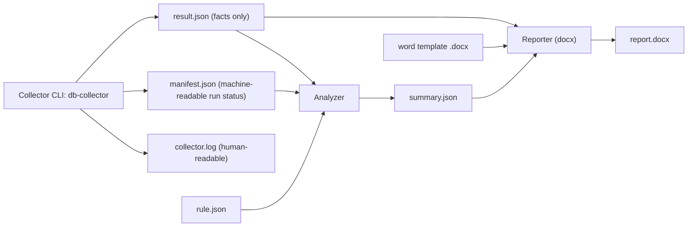
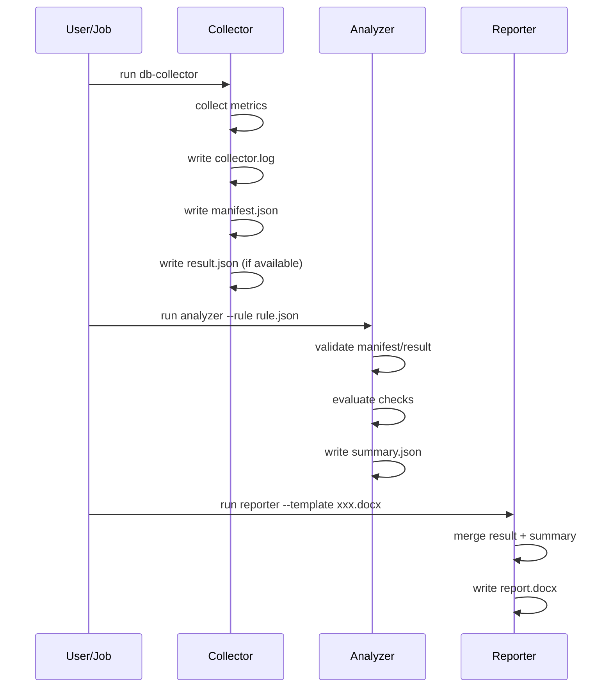

# 数据库巡检最小可落地规范（MVP）

适用日期：2026-03-05  
适用范围：`db-collector`、分析器、报告生成器  
目标：指导并约束后续开发，保证架构清晰、契约稳定、可审计可回放。

## 1. 目标与边界

1. 统一巡检链路：采集、分析、报告职责解耦。
2. `result.json` 保持事实层纯净，不承载执行状态判定。
3. 执行态单独沉淀到 `manifest.json`，避免“仅日志可见”。
4. 允许采样模式可配：周期采样或默认单次采样。

## 2. 总体架构图



## 3. 执行时序图



## 4. 运行目录规范

每次巡检使用独立目录，建议：

```text
runs/<run_id>/
  collector.log
  manifest.json
  result.json
  summary.json
  report.docx
```

`run_id` 建议格式：`<db_type>-<host>-<yyyymmddThhmmssZ>`。

## 5. 文件职责与最小字段

## 5.1 collector.log

用途：人类可读执行日志。  
要求：记录采集命令、关键阶段、错误堆栈、耗时。

## 5.2 manifest.json（执行清单，新增）

用途：机器可读运行状态与产物索引。  
最小字段建议：

```json
{
  "schema_version": "1.0",
  "run_id": "mysql-192.168.1.101-20260305T025500Z",
  "db_type": "mysql",
  "start_time": "2026-03-05T10:54:12+08:00",
  "end_time": "2026-03-05T10:55:23+08:00",
  "exit_code": 10,
  "overall_status": "partial_success",
  "module_stats": {
    "os": {"status": "success", "duration_ms": 3200, "error": null},
    "db_perf": {"status": "partial", "duration_ms": 2600, "error": "p_s digest truncated"}
  },
  "artifacts": {
    "log": "collector.log",
    "result": "result.json",
    "summary": "summary.json",
    "report": "report.docx"
  }
}
```

状态枚举：`success | partial | failed | skipped`。  
`overall_status` 枚举：`success | partial_success | failed`。

## 5.3 result.json（事实层）

用途：只存事实数据，不存分析结论与模块状态。  
最小字段建议：

```json
{
  "meta": {
    "schema_version": "2.0",
    "collector_version": "1.2.0",
    "db_type": "mysql",
    "db_host": "192.168.1.101",
    "db_port": 3306,
    "db_name": "order_db",
    "environment": "production",
    "timezone": "Asia/Shanghai",
    "collect_time": "2026-03-05T10:55:23+08:00"
  },
  "collect_config": {
    "sample_mode": "single",
    "sample_interval_seconds": null,
    "sample_period_seconds": null,
    "expected_samples": 1
  },
  "collect_window": {
    "window_start": "2026-03-05T10:55:23+08:00",
    "window_end": "2026-03-05T10:55:23+08:00",
    "duration_seconds": 0
  },
  "os": {},
  "db": {}
}
```

约束：
1. 原始值字段禁止写入单位字符串，统一数值字段 + 单位字段。
2. 时间统一 RFC3339（含时区）。
3. 缺失数据必须可区分：`failed`、`skipped`、`not_applicable`。

## 5.4 summary.json（分析结果层）

用途：分析器基于 `rule.json` + `result.json` 产出判定视图。  
最小字段建议：

```json
{
  "schema_version": "1.0",
  "run_id": "mysql-192.168.1.101-20260305T025500Z",
  "rule_version": "2.0",
  "generated_at": "2026-03-05T11:00:00+08:00",
  "overall_risk": "high",
  "counts": {
    "total_checks": 128,
    "normal": 60,
    "warning": 40,
    "critical": 8,
    "unevaluated": 18,
    "not_applicable": 2
  },
  "abnormal_items": [],
  "unevaluated_items": [],
  "na_items": []
}
```

失败场景（`manifest.exit_code` 为 `20/30`）补充约束：
1. `overall_risk` 固定为 `high`（失败保守原则）。  
2. 不进入常规评估（`normal/warning/critical` 必须为 `0`）。  
3. `abnormal_items` 必须为空数组。  
4. 必须包含 `failure` 摘要对象：

```json
{
  "failure": {
    "exit_code": 20,
    "reason_type": "collector_failed",
    "message": "collector exited with 20: collection failed"
  }
}
```

## 5.5 report.docx

用途：面向业务与运维人员的可读报告。  
输入：`template.docx + result.json + summary.json`。

## 6. CLI 最小接口规范

## 6.1 Collector

```bash
db-collector --db-type <mysql|oracle> [连接参数] [采集参数]
```

采集参数最小建议：
1. `--sample-interval-seconds`  
2. `--sample-period-seconds`  
3. `--output-dir`
4. `--run-id`（可选，不传则自动生成）

模式规则：
1. 两个采样参数均不传：默认 `single`（单次）。
2. 两个参数都传且合法：`periodic`。
3. 只传其中一个：参数错误并退出。

## 6.2 Analyzer

```bash
db-analyzer --result <result.json> --rule <rule.json> --manifest <manifest.json> --out <summary.json>
```

## 6.3 Reporter

```bash
db-reporter --result <result.json> --summary <summary.json> --template <template.docx> --out <report.docx>
```

## 7. 退出码规范

1. `0`：采集成功，数据完整可分析。  
2. `10`：部分成功，存在失败/跳过，但可继续分析。  
3. `20`：采集失败，无有效结果。  
4. `30`：参数/连接/权限错误（前置失败）。

## 8. 缺失语义统一

字段缺失必须标注语义（可通过 `manifest.module_stats` 或 result 附加元字段表达）：

1. `failed`：本应采集但执行失败。  
2. `skipped`：根据策略跳过。  
3. `not_applicable`：当前场景不适用。

规则侧建议：
1. 每个 check 增加 `source_module` 字段，显式指定来源模块。  
2. 分析器优先使用 `source_module`，避免依赖 `check_id` 主编号推断模块。  

分析器处理建议：
1. `failed` -> `unevaluated`，原因写入 `summary.unevaluated_items`。  
2. `skipped` -> `unevaluated`，说明为“策略跳过”。  
3. `not_applicable` -> 不计入风险告警，可单独统计。

## 9. 质量门禁

分析前必须通过：

1. JSON schema 校验（`contracts/schemas/*.schema.json`）。  
2. 时间窗口校验（样本时间必须落在 `collect_window`）。  
3. 类型校验（数字、布尔、枚举一致）。  
4. 产物一致性校验（`manifest` 引用的文件真实存在）。

建议统一使用：

```bash
python3 tasks/validate_frozen_contracts.py --run-dir runs/<run_id>

# CI 推荐
python3 tasks/validate_frozen_contracts.py --run-dir runs/<run_id> --strict-schema

# 本地一键门禁（推荐）
python3 tasks/local_gate.py run --run-dir runs/<run_id> --rule /path/to/rule.json
```

## 10. 版本演进策略

1. 每个文件单独 `schema_version`。  
2. 兼容期允许双写字段（旧 + 新），新字段优先读取。  
3. 进入收敛阶段后下线旧字段并发布迁移说明。

## 11. 开发落地清单（MVP）

1. Collector 增加 `manifest.json` 输出。  
2. Collector 固化退出码约定。  
3. Analyzer 接入 `manifest` 并支持 `unevaluated` 归因。  
4. Reporter 仅消费 `result + summary`，不依赖日志。  
5. CI 增加三类校验：schema、样例回放、模板渲染冒烟。

---

该规范优先保证“可运行、可追溯、可扩展”，后续可在不破坏链路的前提下扩展规则与指标深度。
